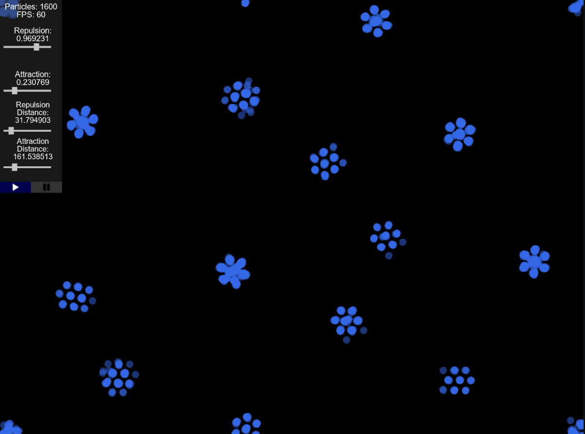

# ParticleSandbox (under construction)
**A particle simulator and sandbox in C++**
(under construction)



### Dependencies
I provide the dependencies for Visual Studio 17 2022 (x64 and Debug) but otherwise, you have to provide them and edit the environment file (project/env.bat)
Currently only MSVC is supported because of the check for support of AVX/AVX2/AVX512/SSSE3/SSSE4 (__cpuid)

- **GLFW**
- **FreeType**
- **GL3D** _(header only, no need to replace it)_
- **GLM** _(header only, no need to replace it)_

This application uses AVX2 for performance and i prefer not to use multithread by default.
However, if your machine doesn't suppport AVX2, application is rendered by using multithreads.

## Build

```
Default Parameters:
Architecture=x64
Generator="Visual Studio 17 2022

$ particle --build -G [generator] -A [platform/arch]  
or
$ particle -b
```