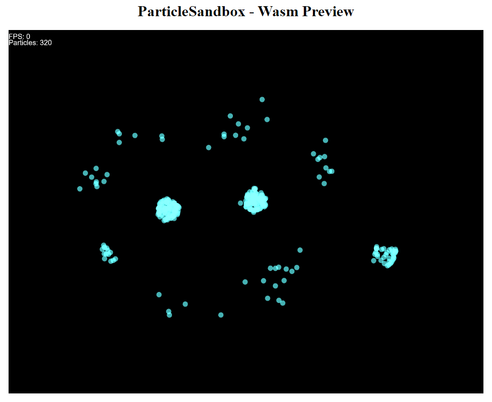

# ParticleSandbox
**A WASM compilation with Emscripten NOT WORKING NOT MAINTAINED**



Using emscripten 3.1.9 and MingW (MSYS2), i precompiled librairies for Release.
Everything needed is in this folder to simplify deployment. Might be changed later.

### Dependencies
You need to recompile dependencies for wasm. 
For now, you only need FreeType which i have precompiled in this repository
- GLAD is replaced by Emscripten WebGL implementation.
- GLFW become useless too as there isn't a window anymore.
The rest is header-only, you just have to copy it into ~project/wasm/inc repertory. (GLM and freetype includes)

Note : If you are using WASM you can't display the UUID of Objects into string. It might be possible to make it work though. (uuid_v4)

## Build

You need to have Emscripten 3.1.9 or another version compatible and MingW64 from MSYS2.
You can try other compiler who can work with Emscripten ToolChain but you'll have to recompile FreeType too using the same toolchain and compiler.
```
$ build.bat
```

The result is in ~/project/wasm/web
You only need to launch an HTTP Server like SimpleHTTPServer from python.